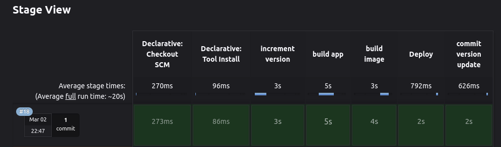

# Building a Robust CI/CD Pipeline with Jenkins, Maven, ECR, and Docker Compose

In today's fast-paced software development world, continuous integration and continuous delivery (CI/CD) pipelines are essential for rapid development, improved code quality, and efficient deployments. This blog post will guide you through building a robust CI/CD pipeline using Jenkins, Maven, Amazon Elastic Container Registry (ECR), and Docker Compose.



**Tools Uses:** Git, Java, Maven, Jenkins, AWS, ECR, EC2, Docker, Docker-Compose, Ubuntu

## Project Structure:
- **Source Code Repository:** This will reside in a Git repository from GitHub or GirLab. It will hold the application's source code and any relevant configuration files.
- **Jenkins Pipeline Script:** This script defines the stages of your CI/CD pipeline and triggers specific actions within Jenkins.

- **Dockerfile:** This file defines the instructions for building your application's Docker image, specifying the base image, dependencies, and application code to be included.
- **docker-compose.yml:** If your application involves multiple containers, this file defines the services, configurations, and dependencies for running them together using Docker Compose.
- 
### Setting Up Jenkins:

**Establishing Jenkins Infrastructure on AWS:**
Initiated the deployment of an AWS EC2 instance, meticulously configuring the associated security group to allow inbound traffic on ports 22, 8080, and 5000. Subsequently, executed the installation of Jenkins using a designated shell script for streamlined implementation.


[install_jenkins.sh](https://gist.github.com/akiltipu/b2f56247878d794f1c3321579646254e)
  
**Installing Docker and Docker Compose on Jenkins Server from this sh script.**
[install_docker_dockercompose.sh](https://gist.github.com/akiltipu/ecccd0383500cf37e4fb9a8c440aed3a)

### Jenkinsfile Overview

This CI/CD pipeline is defined in a Jenkinsfile, a Groovy script that orchestrates the entire process. Let's break down each stage:

**`increment version` Stage:**
    
This stage increments the version of the application using Maven. It parses the current version, increments the incremental version, and commits the change.  

-   Uses the Maven `build-helper:parse-version` plugin to extract the current version from the `pom.xml` file and increment the minor version. 
-   Updates the version in the `pom.xml` and commits the change.
-   Sets environment variables for the image name `(IMAGE_NAME)` that combines the incremented version and build number.

          stage('increment version') {
            steps {
                script {
                    echo 'incrementing app version...'
                    sh 'mvn build-helper:parse-version versions:set \
                        -DnewVersion=\\\${parsedVersion.majorVersion}.\\\${parsedVersion.minorVersion}.\\\${parsedVersion.nextIncrementalVersion} \
                        versions:commit'
                    def matcher = readFile('pom.xml') =~ '<version>(.+)</version>'
                    def version = matcher[0][1]
                    env.IMAGE_NAME = "$version-$BUILD_NUMBER"
                    echo "############ ${IMAGE_REPO}"
                }
            }
    
**`build app` Stage:**  
Here, Maven is utilized to clean the project and package the application, ensuring a clean build before moving forward.
-   Executes `mvn clean package` to clean the project and create a distributable package (`JAR` file).
```
stage('build app') {
            steps {
                script {
                    echo 'building the application...'
                    sh 'mvn clean package'
                }
            }
```
    
**`build image` Stage:**  
This stage involves building a Docker image of the application and pushing it to AWS ECR, ensuring a secure and scalable registry for containerized applications.
-   Builds a Docker image using the `docker build` command.
-   The image name is dynamically constructed from the environment variables `IMAGE_REPO` and `IMAGE_NAME`.
-   Utilizes *AWS credentials* stored in Jenkins (credentials ID: `aws-ecr`) to log in to ECR.
-   Pushes the built image to the designated ECR repository using `docker push`.

```
            stage('build image') {
            steps {
                script {
                    echo 'building the docker image...'
                    withCredentials([usernamePassword(credentialsId: 'aws-ecr', passwordVariable: 'PASS', usernameVariable: 'USER')]) {
                        sh "docker build -t ${IMAGE_REPO}:${IMAGE_NAME} ."
                        sh "echo $PASS | docker login -u $USER --password-stdin ${ECR_REPO_URL}"
                        sh "docker push ${IMAGE_REPO}:${IMAGE_NAME}"
                    }
                }
            }
        }
```
   **`Deploy` Stage:**
   
This stage deploys the application to an EC2 instance by copying necessary files and executing a deployment script using SSH and executing docker-compose.  

-   Defines a deployment script named web-deploy.sh assumed to be present in the project directory.

-   Uses SSH with key authentication (credentials ID: `web-server-key`) to connect to a target server instance (defined by `SERVER_INSTANCE_USER` and `SERVER_INSTANCE_IP`).
    
-   Securely copies the deployment script (`web-deploy.sh`) and `docker-compose.yml` (assumed to be present) to the server using `scp.`
-   Executes the deployment script (`deployCmd`) on the server, which presumably leverages `docker-compose` to deploy the application using the recently pushed image.
```
stage('Deploy') {
            steps {
                script {
                    // def ec2Instance = 'ubuntu@107.20.79.59'
                    def ec2Instance = "$SERVER_INSTANCE_USER@$SERVER_INSTANCE_IP"
                    def deployCmd = "bash ./web-deploy.sh ${IMAGE_NAME}"

                    sshagent(['web-server-key']) {
                        sh "scp -o StrictHostKeyChecking=no web-deploy.sh ${ec2Instance}:/home/ubuntu"
                        sh "scp -o StrictHostKeyChecking=no docker-compose.yaml ${ec2Instance}:/home/ubuntu"
                        sh "ssh -o StrictHostKeyChecking=no ${ec2Instance} ${deployCmd}"
                    }
                }
            }
        }
```

**`commit version update` Stage:**  
In this final stage, the version update is committed to the Git repository, closing the loop and ensuring version history consistency.
    
-   Utilizes a pre-configured GitHub token credential (ID: **`GithubToken`**) to access the Git repository securely.
-   Updates Git configuration within the Jenkins job to use the Jenkins user for commits.
-   Sets the origin URL for the Git repository to include the access token.
-   Stages all changes in the project directory.
-   Commits the version bump `update` with a descriptive message.
-   Pushes the commit changes to the `main` branch of the Git repository.

 ``` 
 stage('commit version update') {
            steps {
                script {
                    withCredentials([string(credentialsId: 'GithubTokenSimple', variable: 'GITHUB_TOKEN')]) {
                        sh 'git config user.email "jenkins@example.com"'
                        sh 'git config user.name "Jenkins"'
                        sh "git remote set-url origin https://${GITHUB_TOKEN}@$GIT_REPO_URL"
                        sh 'git add .'
                        sh 'git commit -m "ci: version bump"'
                        sh 'git push origin HEAD:main'
                    }
                }
            }
```

**Jenkins Plugin uses:** Amazon EC2, SSH Agent, Maven

Sample Example Environment: 
```
    environment {
        ECR_REPO_URL='1234567891.dkr.ecr.us-east-1.amazonaws.com'
        ECR_APP_NAME='simple-pipeline-app'
        SERVER_INSTANCE_IP='000.000.00.00'
        SERVER_INSTANCE_USER='ubuntu'
        GIT_REPO_URL='github.com/user/repo-name.git'
        IMAGE_REPO = "$ECR_REPO_URL/$ECR_APP_NAME"
    }
```
